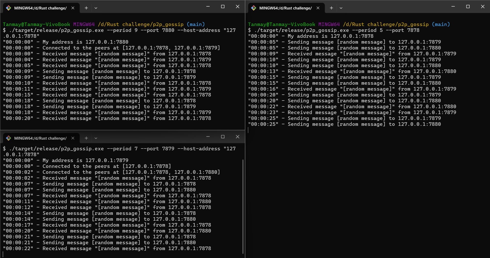

# P2P Gossip

Peer to peer gossip application implementation in rust. It provides a cli interface to start it and connect to other peers. Once connected, the peer sends random messages to other peers every N seconds. The messaging period is also specified through command line. When a peer receives a message, it prints it to the console.

# How to use

1. Build the application using cargo build:
```bash
cargo build --release
```

2. Start a single node with a period of 5 seconds and set port to 7878 (rust spelled out numerically).
```bash
./target/release/p2p-gossip.exe --period 5 --port 7878
```

3. This will start a single node at the address: ```127.0.0.1:7878```. To connect other nodes to this, create another node with this command:
```bash
./target/release/p2p-gossip.exe --period 7 --port 7879 --host-address "127.0.0.1:7878"
```

This will start the node at ```127.0.0.1:7879``` and connect it to the earlier node. They will start sending random messages to each other as soon as they are connected.

4. Now these two nodes are interacting with each other. Meanwhile, a third node can also be instantiated. As mentioned above, as soon as the third node will connect to the one of the nodes, it will be connected to the other peers also, starting a full-fledged p2p network. Use this command to start the third node:
```bash
./target/release/p2p-gossip.exe --period 9 --port 7880 --host-address "127.0.0.1:7878"
```

5. Now they all are in the peer-to-peer network sending random messages to each other. The end result will look something like this:

